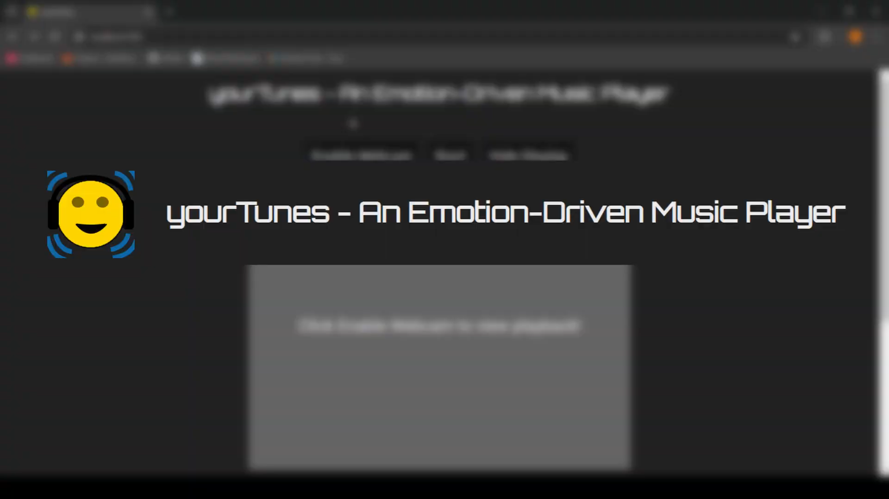

# yourTunes - An Emotion-Driven Music Player

## Introduction

**yourTunes** is a JavaScript-based web application developed for the ICS2000 unit project. It uses Flask to host a music player that identifies a user's emotions through their webcam feed and plays music that matches their current mood.

## Demo Video

[](https://drive.google.com/file/d/17R6D93Y_82Nl0nTm9jW49_mV0Ejs7geW/view?usp=sharing)

## How It Works

yourTunes utilizes the Viola-Jones method for face detection via the OpenCV.js library, using a Haar-cascade for front facial detection. The detected face is cropped, converted to grayscale, and resized to 224x224 pixels. This image is then analyzed by a TensorFlow model, trained using Teachable Machine, which classifies the face into one of seven emotions: Happy, Sad, Angry, Disgust, Fear, Surprise, and Neutral. The emotion with the highest confidence score is selected, and the application plays a corresponding song based on this emotion.

## Usage

To get started with yourTunes:

1. Ensure you have Python and Flask installed on your system.
2. Run the `flask-app.py` script to host the application:
   ```bash
   python flask-app.py
   ```
3. Access the application by navigating to `http://localhost:5000/` in your web browser.
4. Enjoy your personalized music experience!

## Spotify Integration
The application uses Spotify’s API to play tracks, which **requires a Premium subscription** for full-length playback. Users with a free Spotify account will only have access to previews or snippets of the songs. [Upgrade to Spotify Premium](https://www.spotify.com/premium/) to enjoy unlimited access to full tracks.

## Getting Started

### Prerequisites

- Python 3.x
- Python libraries: `Flask`, `render_template`, `send_from_directory`, `request`, `abort`, `jsonify`, `os`, `json`

### Installation

Clone the repository:
   ```bash
   git clone https://github.com/AFLucas-UOM/yourTunes.git
  ```

## Contributions

Contributions to enhance the application or add new features are welcome! Please fork the repository, make your changes, and submit a pull request.

## License

This project is licensed under the MIT License. See the [LICENSE](LICENSE) file for details.

## Acknowledgments

This project was developed as part of an academic assignment. Unit: CPS2000 at the University of Malta.

## Contact

For any inquiries or feedback, please contact [Andrea Filiberto Lucas](mailto:andrealucasmalta@gmail.com).
